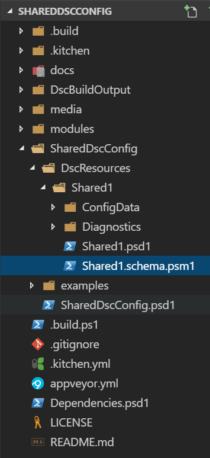
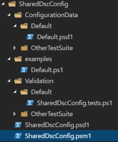

# Shared Dsc Configurations

This project is intended to suggest a new structure for sharing DSC Configuration, taking most of the ideas from Michael Greene in [the dscconfigurations repo](https://github.com/powershell/dscconfigurations).

## Intent
<div style="align:right">
The intent is to have a more familiar structure to standard PowerShell modules. Not only this would help user adoption by
reducing the bar of entry, it would allow Build tools, tasks and scripts to be more standardized and re-usable.

- Allow direct re-use in Production (no copy-paste/modification of DSC Config or data)
- Declare Dependencies in Module Manifest for Pulling requirements from gallery
- Reduce bar of entry with familiar scaffolding
- Embed default Configuration Data
- Be CI/CD tool independant
- Support test-kitchen model (i.e. module injection, Test Suite)
- De-Clutter module once published to Gallery (i.e. Removing .Build files)

## Ideas to discuss

Below are ideas I think worth discussing and suggestion of implementation. Please raise issues to discuss them.

### Repository Structure
The Shared Configuration should be self contained, but will require files for building/testing or development.
The repository will hence need some project files on top of the files required for functionality.

Adopting the 2 layers structure like so:
```
+-- ConfigurationName\
    +-- ConfigurationName\
```
Allows to place Project files like build, CI configs and so on at the top level, and everything under the second level are the files that need to be shared and will be uploaded to the PSGallery.


Within that second layer, the Configuration looks like a standard module with some specificities, the benefits are multiple:
- Familiar module layout
- easy packaging
- Explicit dependencies in psd1 (pull all in one command from gallery)
- Metadata for gallery search


### Configuration Data

This is tricky to get right.

The configuration data, IMO, should be managed in an 'override-only' way to preserve the cattle vs pet case. That is: 
- everything is standard (the standard/best practice data being shared along the configuration script), 
- but can be overriden in specific cases when required.

This cannot be done out of the box, but it's possible using custom scripts or module, as I intend in my [Datum](https://github.com/gaelcolas/datum) module.

The challenge is then to manage the config data for a shared config in a way compatible with using a Configuration Data management module such as Datum.


I see two possible approach:
- Conform with the most documented approach which is to cram properties under statically define values in hashtable: i.e. `$Node.Role.property` or `$AllNodes.Role.Property`
- Introduce the less documented, more flexible way to resolve a property for the current Node via a function: i.e. `Resolve-DscProperty -Node $Node -PropertyPath 'Role\Property'`

The second one is more flexible, but probably needs some time and a lot of communication before taking precedence over the static way.

We could provide a standard, simple function to resolve the static properties when creating Shareable configurations, where the logic can be overriden where consuming that shared configuration.

```PowerShell
function Resolve-DscConfigurationData {
    Param(
        [hashtable]$Node,
        [string]$PropertyPath,
        [AllowNull()]
        $Default
    )

    $paths = $PropertyPath -split '\\'
    $CurrentValue = $Node
    foreach ($path in $Paths) {
        $CurrentValue = $CurrentValue.($path)
    }

    if ($null -eq $CurrentValue -and !$PSBoundParameters.ContainsKey('Default')) {
        Throw 'Property returned $null but no default specified.'
    }
    elseif ($CurrentValue) {
        Write-Output $CurrentValue
    }
    else {
        Write-Output $Default
    }
}
Set-Alias -Name ConfigData -value Resolve-DscConfigurationData
Set-Alias -Name DscProperty -value Resolve-DscConfigurationData
Set-Alias -Name DscProp -value Resolve-DscConfigurationData
```

This Allows to resolve static data so that: 
```PowerShell
DscProp -Node @{
        NodeName='localhost';
        a=@{
            b=122
        }
    } -PropertyPath 'a\b'
```
Resolves to `122`, but another implementation of Resolve-DscConfigurationData could do a database lookup in the company's CMDB for instance.

Doing so would allow to have functions to lookup for Configuration Data from the Shared Configuration, or from custom overrides.

### Root Tree
<div style="align:right">
The root of the tree would be similar to a module root tree where you have supporting files for, say, the CI/CD integration.

In this example, I'm showing (although currently empty) what I usually do:
- a .Build.ps1 that defines the build workflow by composing tasks (see [SampleModule](https://github.com/gaelcolas/SampleModule))
- a .build/ folder, which includes the minimum tasks to bootstrap + custom ones
- the .gitignore where folders like BuildOutput or kitchen specific files are added (`module/`)
- the Dependencies.psd1, so that the build process can use PSDepend to pull any prerequisites to build that project
- the test-kitchen configuration file (for kitchen CI integration)
- the appveyor configuration file (for appveyor CI integration)
- supporting files like License, Readme, media...


## Configuration Module Folder
<div style="align:right">

Very similar to a PowerShell Module folder, the Shared configuration re-use the same principles and techniques.

The re-usable configuration itself is declared in the ps1, the metadata and dependencies in the psd1 to leverage all the goodies of module management, then we have some assets ordered in folders:
- ConfigurationData: the default/example configuration data, organised in test suite/scenarios
- Validation: the pester tests used to validate the configuration, per test suite/scenario
- the examples of re-using that shared configuration, per test suite/scenario
